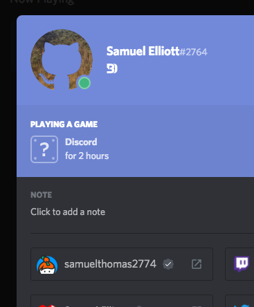

Discord Keybase Integration
===

Adds Keybase proofs to Discord.

This is a plugin for BetterDiscord v2, which is currently in development. It also uses features currently only available in [this branch](https://github.com/samuelthomas2774/betterdiscordapp/tree/discord-api).

### To do

- [x] Add Keybase proofs to the user profile modal
- [x] Add Keybase accounts to the content author popout (in plugin info)
- [ ] Validate plugin/theme authors
    - Maybe just sign an object in the plugin/theme config.json
- [ ] Add caching of proofs
- [ ] Verify plugins and themes using their GitHub repository, which can be used to prove the author's Keybase account
    - Needs the origin of plugins and themes to be verified, so this can't be added until BetterDiscord v2 is actually released, with support for downloading plugins and themes from the BetterDiscord website
- [ ] Fix verified tooltip in the user profile modal

Installation
---

To install [download and unzip the latest `release.zip` from GitHub](https://github.com/samuelthomas2774/discord-keybase-integration/releases/latest) to BetterDiscord's `ext/plugins` directory.

For more information about how to actually use the plugin and add proofs, see the support server (you have to join the server to post and verify proofs anyway at the moment).

Screenshots
---



Adding Keybase proofs to your Discord account
---

To prove your Keybase account and your Discord account are the same person, post a message signed with your PGP key in the #proofs channel.

This message should contain a JSON object with your Discord user ID and your Keybase username in a code block, like this:

```
{"keybase_proof": "discord", "discord": "284056145272766465", "keybase": "samuelthomas2774"}
```

This object must contain three properties: `keybase_proof`, which must be set to `"discord"`, `discord`, which should be set to your user ID, and `keybase`, which should be set to your Keybase username. It can also contain a `position` property, which specifies the position the proof should be added to your connected accounts at.

Then you need to sign that object, which is easily done with the Keybase command line client:

```
keybase pgp sign -m "{\"keybase_proof\": \"discord\", \"discord\": \"284056145272766465\", \"keybase\": \"samuelthomas2774\"}"
```

(Remember to escape the quotes.)

This will return a signature with the `-----BEGIN PGP MESSAGE-----` header. You just need the bit without the headers, like this:

```
xA0DAAoBhCDHzeQ9xNYBy+F0AOIAAAAA5nsia2V5YmFzZV9wcm9vZiI6ICJkaXNj
b3JkIiwgImRpc2NvcmQiOiAiMjg0MDU2MTQ1MjcyNzY2NDY1IiwgImvkZXliYXNl
IjogInNhbXVlbON0aG9tYXMyN+I3NCJ9AMLBXAQAAQoAEAUCWutLxAkQhCDHzeQ9
xNYAACBQEADBZNIWJJLghHVxsAup3Qqu+BcJg9Zl1BDGr+uy+W+boWdm9QjQ+poC
ob3giBOVmhvXmf/Ze9oi7fFVce+DjITdaRT4C6AbcBfi1/eP55rhw0Z+XVh77E8g
2o1atAynsW0IT29iZ2Aiq+WF+ocsSrR0v4w9/WGfbfNJKzQ7Za8o44gC8Pa/DNkY
NPv2iN7Z7Vt/fR7lCewNv4s/BaHfAEm5L1dKOjILhz17PocBcMxkOJtSpNBJUrk2
BfeI/cmtmJJRnq+gcQu+Bc0KmXL1eRZ5xQ/GYxRUArLlr6aANG6yoBWIjqIP42q1
GSCw+E+gD9e8DO+hl1/ZhJnkWmmjTHm+Jpu1QkHi9VhByF5OiWXcr4tqF7CAAUGW
cn7J61E+2t5BozvI7I+niOllsfLl/AFBbxcliWb6u2sWz5LHYJ8gSLzb8NQnzVJW
S9T821/9FmBb4klt/Mjt5WQpUjD8V5+AClRQ3r0hR5BP88g7hcnS1jbMhxUUQMGL
jhpb0MLpUiovklaEUoc74LEHp7mJ8OjSDlsV52E77bvx6f7Umblh3plCetgliOcE
sUjn7rBWcAoaYS2cJvtiO5YI6Q/prAD9LM6t0mUfbUpL8Mq4VJCoEqxOmW3J+P5e
xD4kjtoTi09Xei3rKIuOt/yUIoRYX4Z4qTu0hWm1DX0q0CMSFquWIQ==
=gn9n
```

Then post a message in #proofs containing the JSON object and it's signature in their own code blocks:

    ```
    {"keybase_proof": "discord", "discord": "284056145272766465", "keybase": "samuelthomas2774"}
    ```
    ```
    xA0DAAoBhCDHzeQ9xNYBy+F0AOIAAAAA5nsia2V5YmFzZV9wcm9vZiI6ICJkaXNj
    b3JkIiwgImRpc2NvcmQiOiAiMjg0MDU2MTQ1MjcyNzY2NDY1IiwgImvkZXliYXNl
    IjogInNhbXVlbON0aG9tYXMyN+I3NCJ9AMLBXAQAAQoAEAUCWutLxAkQhCDHzeQ9
    xNYAACBQEADBZNIWJJLghHVxsAup3Qqu+BcJg9Zl1BDGr+uy+W+boWdm9QjQ+poC
    ob3giBOVmhvXmf/Ze9oi7fFVce+DjITdaRT4C6AbcBfi1/eP55rhw0Z+XVh77E8g
    2o1atAynsW0IT29iZ2Aiq+WF+ocsSrR0v4w9/WGfbfNJKzQ7Za8o44gC8Pa/DNkY
    NPv2iN7Z7Vt/fR7lCewNv4s/BaHfAEm5L1dKOjILhz17PocBcMxkOJtSpNBJUrk2
    BfeI/cmtmJJRnq+gcQu+Bc0KmXL1eRZ5xQ/GYxRUArLlr6aANG6yoBWIjqIP42q1
    GSCw+E+gD9e8DO+hl1/ZhJnkWmmjTHm+Jpu1QkHi9VhByF5OiWXcr4tqF7CAAUGW
    cn7J61E+2t5BozvI7I+niOllsfLl/AFBbxcliWb6u2sWz5LHYJ8gSLzb8NQnzVJW
    S9T821/9FmBb4klt/Mjt5WQpUjD8V5+AClRQ3r0hR5BP88g7hcnS1jbMhxUUQMGL
    jhpb0MLpUiovklaEUoc74LEHp7mJ8OjSDlsV52E77bvx6f7Umblh3plCetgliOcE
    sUjn7rBWcAoaYS2cJvtiO5YI6Q/prAD9LM6t0mUfbUpL8Mq4VJCoEqxOmW3J+P5e
    xD4kjtoTi09Xei3rKIuOt/yUIoRYX4Z4qTu0hWm1DX0q0CMSFquWIQ==
    =gn9n
    ```

Adding Keybase accounts to your plugins/themes
---

To add your Keybase account to your plugins and themes just add the `keybase_username` property to the author object in your plugin/theme's `config.json`. If you also add your Discord user ID your Discord proofs will be checked.

As there is no proof that the plugin/theme's author is who it says they are the contact information should not be trusted. However as most plugins and themes are hosted on GitHub, you can likely check the author's Keybase account using GitHub, and then use the Keybase account to check the other contact information. (I may add this once BetterDiscord v2 is released and plugins and themes can be downloaded in the plugins/themes panel.)

```json
{
    "info": {
        "authors": [
            {
                "name": "Samuel Elliott",
                "discord_id": "284056145272766465",
                "keybase_username": "samuelthomas2774"
            }
        ]
    }
}
```
